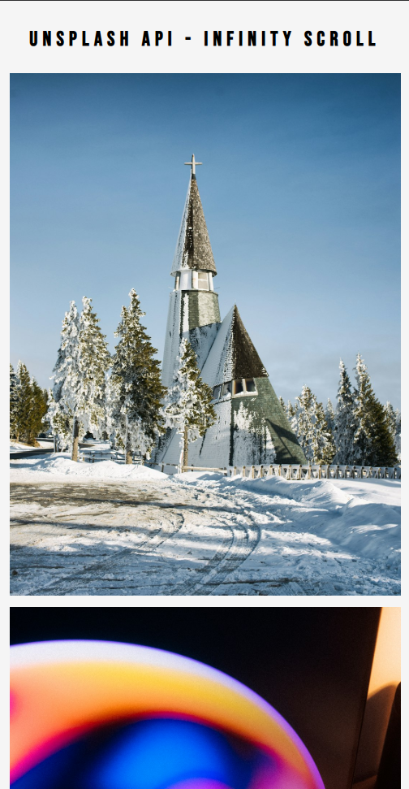
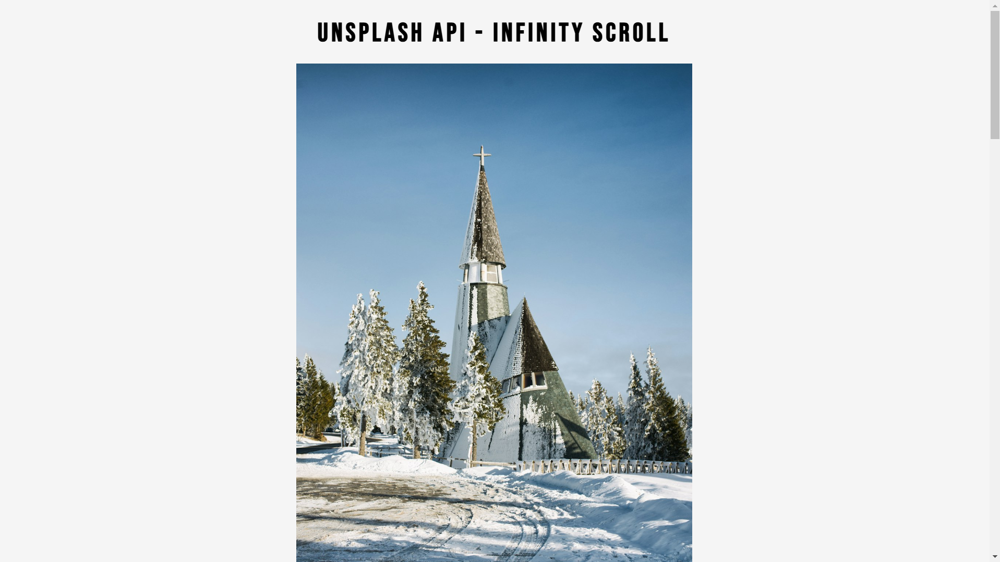

# Infinity Scroll with Unsplash API

This project implements an infinite scroll feature that fetches and displays images dynamically from the Unsplash API. Users can scroll down the page to load more images without refreshing, providing a seamless user experience.

## Features

- **Dynamic Image Loading**: Fetches images from the Unsplash API and displays them on the page.
- **Infinite Scroll**: Loads more images as the user scrolls near the bottom of the page.
- **Responsive Design**: Optimized for both desktop and mobile devices.
- **Loader Animation**: Displays a loading animation while fetching images.

## Project Structure

```
root/
├── index.html      # HTML structure of the page
├── style.css       # Stylesheet for page styling
├── script.js       # JavaScript logic for infinite scroll and API calls
├── loader.svg      # Loader animation (referenced in HTML)
├── infinity.png    # Favicon for the page
```

## Demo

The application dynamically loads images from the Unsplash API and appends them to the page.

## ScreenShot

## Mobileview -

 

## DesktopView -

 

## How It Works

### Core Functionality

1. **Initial Load**:
   - Fetches a small batch of images from the Unsplash API using `fetch` and displays them.

2. **Infinite Scroll**:
   - Listens to the `scroll` event. When the user is near the bottom of the page, additional images are fetched and displayed.

3. **Image Loading Detection**:
   - Tracks when all images in the current batch are fully loaded to prevent unnecessary API calls.

### Key Components

#### **HTML** (`index.html`)
- Contains the main layout, including a title, a loader, and a container for images.

#### **CSS** (`style.css`)
- Styles the page with a clean and responsive design.
- Includes a full-screen loader for a polished loading experience.

#### **JavaScript** (`script.js`)
- Handles fetching images from the Unsplash API.
- Updates the DOM dynamically with images and manages infinite scrolling logic.

---

## Unsplash API Integration

- **API Endpoint**: `https://api.unsplash.com/photos/random`
- **API Key**: The application uses a `client_id` to authenticate requests. Replace the `apiKey` in `script.js` with your own Unsplash API key.

### Example API URL
```
https://api.unsplash.com/photos/random?client_id=YOUR_API_KEY&count=10
```

### Key Parameters
- `client_id`: Your Unsplash API key.
- `count`: Number of images to fetch per request.

---

## Getting Started

### Prerequisites

- A browser that supports modern JavaScript (ES6+).
- An active Unsplash Developer account to get an API key.

### Installation

1. Clone the repository:
   ```bash
   git clone https://github.com/your-repo/infinity-scroll.git
   cd infinity-scroll
   ```

2. Replace the API key in `script.js`:
   ```javascript
   const apiKey = "YOUR_API_KEY";
   ```

3. Open `index.html` in your browser to view the app.

---

## Customization

### Change Initial Image Count
Modify the initial number of images fetched by changing `initialCount` in `script.js`:
```javascript
let initialCount = 5; // Change to your desired initial count
```

### Update Styles
Edit `style.css` to customize fonts, colors, and layout.

---

## Responsive Design

The application is optimized for both desktop and mobile devices:
- Desktop: Centers images with a margin.
- Mobile: Adjusts margins and font sizes for smaller screens.

---

## Known Issues

- **Rate Limiting**: Exceeding Unsplash API limits may cause errors.
- **API Key Security**: Ensure your API key is not exposed in public repositories.

---

## Future Improvements

- Add search functionality to fetch specific images.
- Implement a smoother loading animation.
- Cache previously loaded images to optimize performance.

---

## License

This project is licensed under the MIT License.

